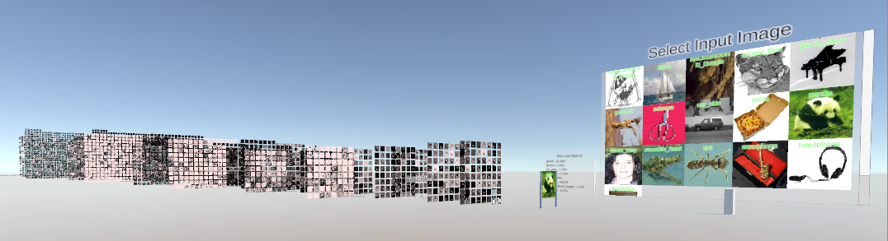
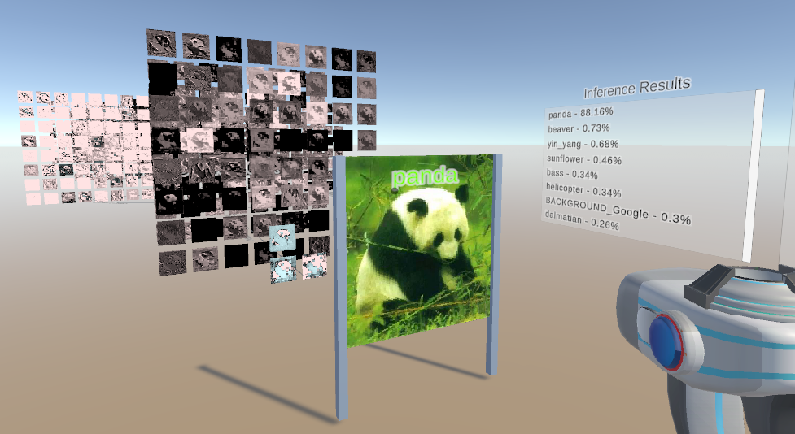
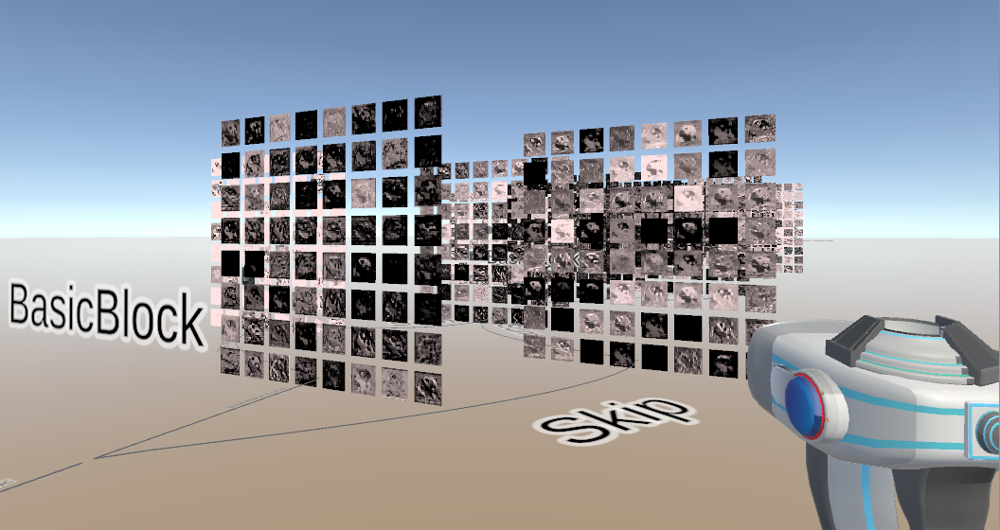
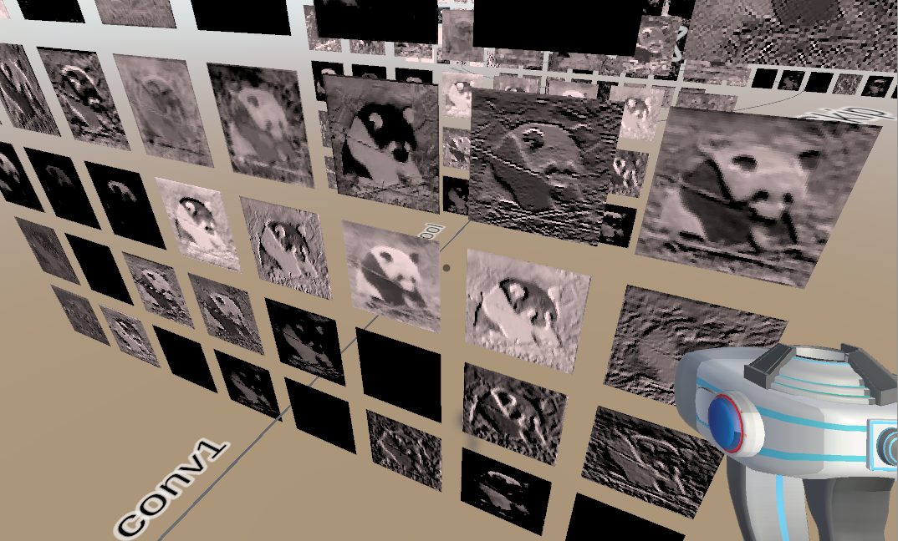

# DeepVisionVR - Interactive 3D Visualization of Deep Neural Networks

This repository is the implementation of DeepVisionVR. It serves as a tool to inspect the activations in deep neural networks in three dimensions. VR Support is currently available for the HTC Vive. The repository contains the Unity project to vision the deep networks, the Python based implementation of the networks and a Docker file to create the Python environment. Currently, the implementation covers two ResNet018 models trained on the CalTech dataset.

The project is still in an early development phase and such is the documentation. 

## Requirements

For the Unity Project:
Unity 2021.1.14f1

For the Deep Learining part:
Install Docker and NVIDIA-docker
Build the Docker image.

The project is easy to set up in Linux, however, in Windows I had issues with the GPU support for Docker containers. Docker Desktop did not grant access to GPU computing. I circumvented the problem by installing Ubuntu in Windows 11 beta using WSL and running the container inside WSL. I recommend this guide https://docs.nvidia.com/cuda/wsl-user-guide/index.html

## Results

