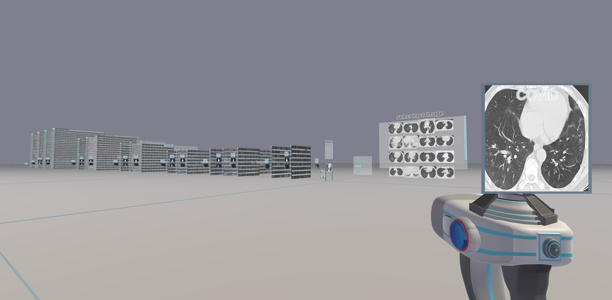
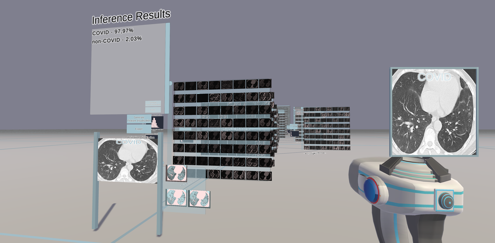
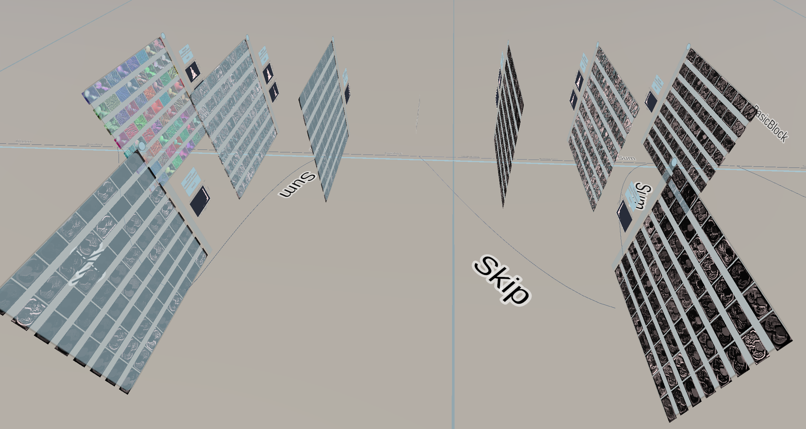

# A Walk in the Black-Box: Deep Convolutional Neural Network Visualization in Virtual Reality 

This repository visualizes deep convolutional neural networks (CNNs) in 3D. The project is split into the client repository ([HERE](https://github.com/Criscraft/DeepVisionVRClient)) and the server repository ([HERE](https://github.com/Criscraft/DeepVisionVRServer)). You will find the releases and the code in these repositories.

Take a walk in your CNN and interact with it to get a more intuitive understanding of Deep Learning. You can visualize your own CNNs or simply start with the demo. The software presents the network layers in 3D. Move and look around, put images into the network and explore how it processes the information. Virtual Reality and desktop mode are available. Currently, CNNs for image classification and segmentation are supported. The software includes some visualization algorithms like feature visualization to reveal what visual concepts the models have learned. 

The repository consists of the client and the server part. The client contains the Unity project to display and to interact with the networks. The server is a Python based implementation, handles the networks and provides the client with data. The server can be run in Docker and an appropriate Dockerfile is included in the respective repository. It uses the Pytorch framework.

## Get started with the demo

Install the client [HERE](https://github.com/Criscraft/DeepVisionVRClient).

Setup the server [HERE](https://github.com/Criscraft/DeepVisionVRServer).

Start the server first by executing
    bash start_falcon_server.sh
and then start the client to take a walk in the black-box.

It is advised to run server and client on different machines due to GPU memory limitations.

The client and server repositories have more detailed information about how to develop DeepVisionVR further.

## How to visualize your own CNN

To visualize your own networks and datasets you will have to modify some scripts on the server side. Nevertheless, it is quite simple! Take a look [HERE](https://github.com/Criscraft/DeepVisionVRServer) for more detailed information.

## Results

